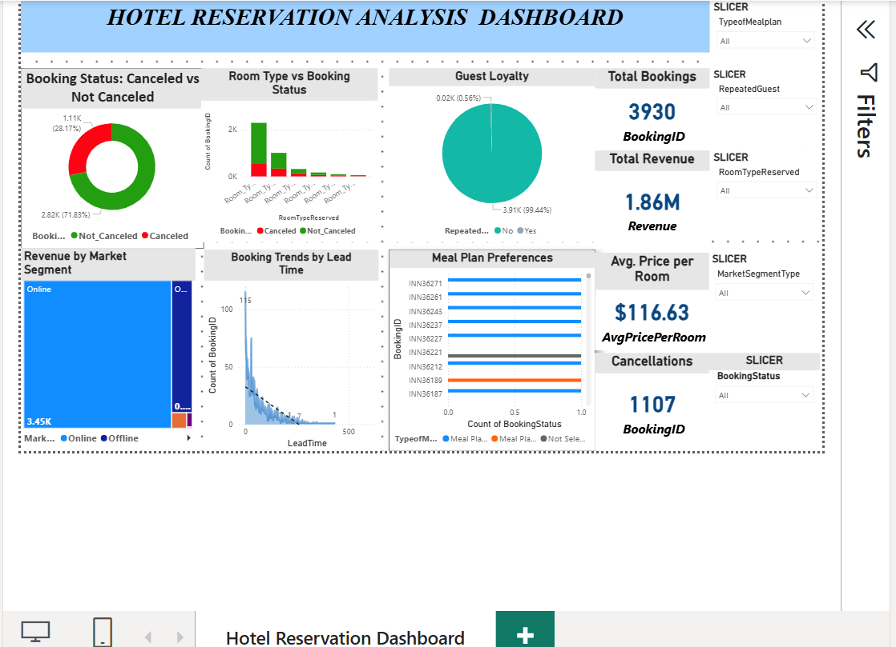
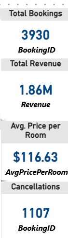
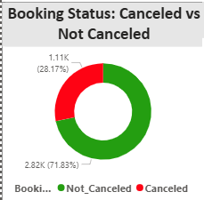
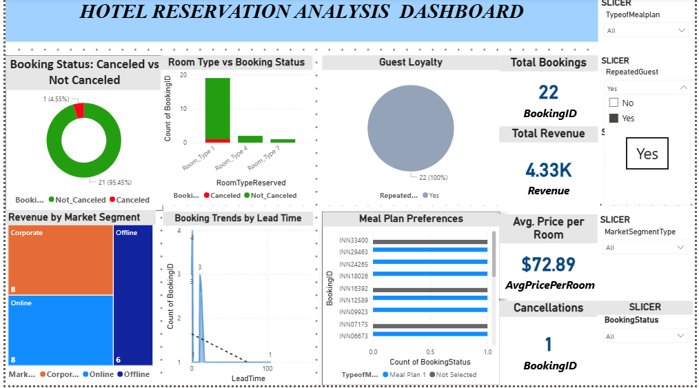

# 🏨 Hotel Reservation Analytics Dashboard

An interactive Power BI dashboard analyzing **3,930 hotel bookings** worth **$1.86M in revenue** to uncover booking patterns, cancellation trends, and customer behavior insights for data-driven hospitality decisions.

---

## 📊 Dashboard Preview

---

## 🎯 Project Overview

This project analyzes hotel reservation data to help hotel management:
- Identify booking patterns and peak periods
- Reduce cancellation rates (currently 28.17%)
- Optimize pricing strategies
- Understand customer segments and loyalty
- Improve revenue through data-driven decisions

---

## 🔑 Key Metrics & KPIs

| Metric | Value |
|--------|-------|
| 📈 Total Bookings | **3,930** |
| 💰 Total Revenue | **$1.86M** |
| 💵 Avg. Price per Room | **$116.63** |
| ❌ Total Cancellations | **1,107** |

---

## 🔍 Key Insights

- **71.83%** of bookings are successful (Not Canceled)
- **28.17%** cancellation rate — a key area for business improvement
- Online market segment drives the majority of revenue
- Lead time strongly impacts booking behavior
- Repeat guests represent only 0.56% — opportunity for loyalty programs

---

## 🎛️ Interactive Features

The dashboard includes **5 interactive slicers** for dynamic analysis:
- 🍽️ Type of Meal Plan
- 🔄 Repeated Guest (Yes/No)
- 🛏️ Room Type Reserved
- 🏢 Market Segment Type
- 📋 Booking Status

---

## 📈 Visualizations Included

1. **Booking Status** — Donut chart (Canceled vs Not Canceled)
2. **Room Type vs Booking Status** — Stacked bar chart
3. **Guest Loyalty** — Pie chart of repeat vs new guests
4. **Revenue by Market Segment** — Treemap (Online vs Offline)
5. **Booking Trends by Lead Time** — Scatter plot with trend line
6. **Meal Plan Preferences** — Horizontal bar chart

---

## 🛠️ Tools & Technologies

- **Microsoft Power BI Desktop** — Dashboard development
- **DAX (Data Analysis Expressions)** — Calculated measures & KPIs
- **Power Query** — Data transformation
- **Microsoft Excel** — Source data file

---

## 💡 Business Recommendations

1. **Reduce cancellations** with flexible policies and deposit incentives
2. **Target online channels** which drive the highest revenue
3. **Build loyalty programs** to grow repeat guest rate
4. **Optimize pricing** based on lead time patterns

---

## 👩‍💻 Author

**Pratima Kandel**  
🎓 Business Analytics Graduate Student | Webster University  
📍 St. Louis, MO  
🚀 Open to Business Analyst Opportunities

---

⭐ *If you found this project helpful, please give it a star!*
